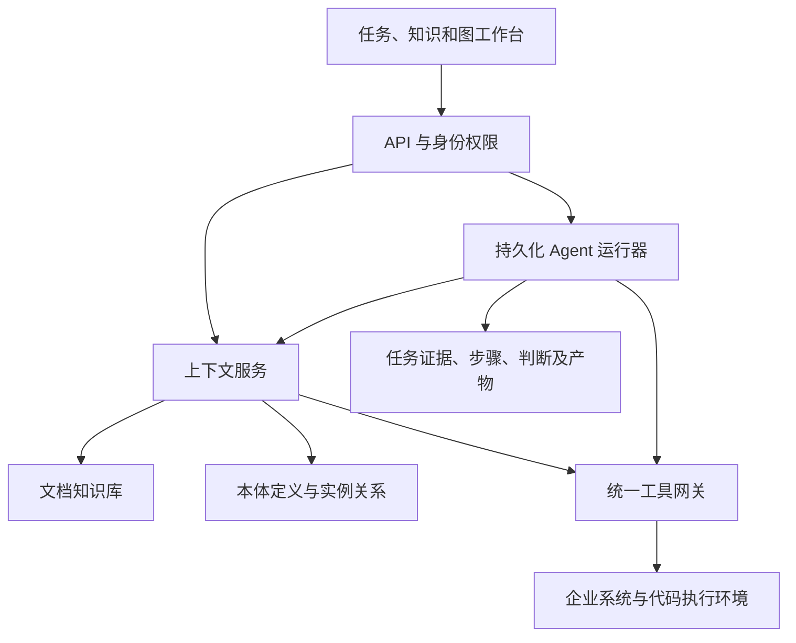

# 架构设计与当前实现

## 目标逻辑架构

权限、版本、审计和评测贯穿各模块，不是单一的执行末端检查。以上为逻辑职责，不要求分别部署微服务。

## 本次工程映射

| 逻辑职责 | 代码 | 当前边界 |
|---|---|---|
| 文档与上下文读取 | `main.py` 文档接口 | 文本检索，不含模型或向量检索 |
| 本体与实例数据 | `db.py`、`graph.py` | 统一类型、关系、固定演示项目过滤 |
| 运行器与任务记录 | `engine.py` | 持久化队列、短事务领取、租约及重试；单进程内后台线程 |
| 工具取证 | `tools.py` | 注册与参数校验、固定项目过滤；业务状态仍为模拟 |
| 模型适配与循环 | `model.py`、`agent.py` | 可配置工具调用接口、轮数限制、引用校验和失败留痕 |
| 代码执行 | `coding_fixture` | 临时目录运行可信样例，不是通用安全沙箱 |
| 三类图工作台 | `static/app.js` | 图查询、路径、来源、任务证据与定义切换 |

## 数据职责

- 文档保存说明与出处；本体定义类型和关系合法性；图谱保存具体事实的投影。
- 部署是否成功的权威应为发布平台，不是图谱缓存。冲突场景展示该边界。
- 每次任务保存当时使用的模拟结果；证据图读取这些记录，不用当前图谱覆盖旧结论。
- 模型或人工提议关系进入候选态，不能自动成为已确认事实。
- 图查询先按服务器固定演示身份过滤对象，再遍历。企业认证尚未实现，不将客户端参数当权限凭据。

## ADR-001：关系型数据库

演示选 SQLite，便于单命令启动、测试和数据持久化。生产 MySQL/PostgreSQL 等产品尚未确定。迁移生产数据库时需引入迁移工具、并发领取策略、日期类型和索引，不能只替换连接字符串。

## ADR-002：演示运行器

保留确定性演示，并提供独立 ModelClient、工具注册表和受限模型循环。只有用户配置服务并选择 model 模式时才发起请求。工具参数和引用由服务端验证，业务结论由程序判断，模型正文仅是草稿。真实模型服务尚未用用户凭据验证。

## ADR-003：图视图

SVG 展示有限局部图；节点拖动仅影响布局。类型定义、实例和证据为不同视图，不构成强制串行处理链。方向查询不经过隐藏节点；候选与失效关系不参与默认已确认路径。图上的关系不能作为因果证明。

## ADR-004：执行部署边界

演示 API 与后台线程在同一个进程。生产阶段拆为 API、任务 Worker、同步 Worker 与隔离执行器；外部高影响动作必须先补齐授权、审批、幂等和结果核对。当前 Docker 默认绑定本机端口，未构建企业安全边界。
