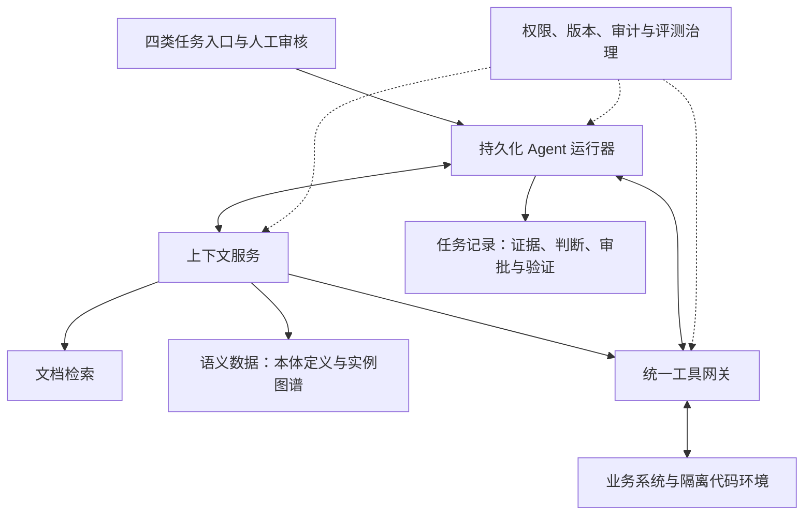

# 通用业务 Agent 平台特性规格说明书

版本：v0.3｜日期：2026-09-30｜状态：架构复审草案

本文件为产品目标规格 v0.3；当前工程实现范围请参见 README.md 和 implementation.md。

适用范围：编码、客诉问答与排查、需求构建、运维分析。

本文依据本次讨论编写，规定拟建设产品的行为、交付物和验收方式。文中的技术选型、排期、容量目标及审批策略均为建议基线，尚未代表已确认的企业制度或已实现能力。

## 01 产品定义与范围

### 1.1 产品目标

建设一个能够接收自然语言任务、检索企业知识、识别业务对象、调用工具取证、执行受控步骤并交付可验证结果的 Agent 平台。平台共用运行器、知识检索、对象关系、权限、审计和评测机制，通过领域能力包覆盖四类工作。

首个贯通场景：客户反馈功能异常 → 关联业务记录、功能和服务 → 查询运行证据及近期发布 → 形成缺陷或需求 → 定位代码并准备修改 → 执行测试 → 生成处理结论和客户回复草稿。

每个领域也可独立发起任务。例如，用户可以直接提交一个新需求或代码修改任务，不要求先创建客诉。

### 1.2 核心概念

| 概念 | 本产品中的含义 | 示例 |
|---|---|---|
| 文档知识库 | 可检索、可引用、有版本和权限的文档内容 | 产品说明、排障手册、故障复盘 |
| Ontology／本体 | 对象类型、属性、关系及合法性约束的定义 | 服务依赖服务，版本包含提交 |
| 知识图谱 | 按本体组织的具体对象和关系事实 | 支付服务对应仓库 A；版本 B 包含提交 C |
| 证据 | 针对某次任务取得、有来源和适用范围的事实记录 | 指定订单在指定时刻的处理状态 |
| 决策规则 | 判断证据是否足够、允许走哪条业务路径的规则 | 宣称已修复前必须确认部署和验证结果 |
| 工具 | 有明确参数、权限和返回结构的查询或执行接口 | 查询发布、创建缺陷、运行测试 |
| 领域能力包 | 领域知识范围、对象定义、工具、流程、规则和案例的组合 | 客诉排查能力包 |

广义知识库可包含文档与图谱；本文并列讨论时，“文档知识库”专指原文与片段。本体是语义契约，实例图谱是按契约组织的对象和关系，两者共同归入语义数据模块。文档与语义数据可以保存在同一个关系型数据库中，不要求分别部署服务或单独采购图数据库。知识关系、历史经验和时间上的先后关系均不能直接充当故障因果证明。

### 1.3 版本边界

| 版本 | 目标 | 动作边界 |
|---|---|---|
| M0 原型 | 查询知识、关联对象、展示证据和建议 | 只读查询；生成平台内部草稿 |
| M1 首版 | 四类任务可独立运行，并贯通一个真实业务闭环 | 经授权创建内部工单或待审核代码变更；运行隔离测试 |
| M2 扩展 | 增加业务领域、检索能力和受控生产动作 | 按企业规则逐项开放对外回复、合并、发布、回滚等动作 |

M1 不承诺自主处理所有企业业务、不承诺自动修复所有故障，也不默认允许生产写操作。首版不要求模型训练、专用向量数据库或多个 Agent 自由协商。

### 1.4 用户角色

| 角色 | 主要能力 |
|---|---|
| 任务发起人 | 提交任务、补充信息、查看本人有权访问的结果 |
| 客服人员 | 查询业务状态、审核回复草稿、移交研发或运维 |
| 产品／需求人员 | 整理诉求、确认范围、审核需求及验收条件 |
| 研发人员 | 检查定位结果、审核代码变更和测试结果 |
| 运维人员 | 审核故障分析、处理操作建议、核实环境状态 |
| 知识／领域负责人 | 审核资料、对象关系、规则和评测案例 |
| 管理员／审计人员 | 配置连接器、权限、版本、预算和审计查询 |

角色可组合，实际权限取用户身份、项目范围、源系统授权及工具权限的交集；平台管理员不因此自动获得所有业务数据访问权。

## 02 总体设计与特性目录

### 2.1 逻辑职责与运行方式

以上为职责图，不是固定调用顺序，也不是微服务部署图。文档、本体、实例图谱是同一知识体系中的不同表达；权限治理还覆盖结果展示、任务记录访问及后台同步，图中的连线只标主要边界。

- 上下文服务按任务选择文档检索、对象解析、关系查询和经工具网关的实时取证，统一返回来源、范围、时间和权限信息。
- 本体主要在数据接入、关系校验、工具契约和查询规划中生效；不要求模型每轮单独读取本体，也不要求所有文档转成图谱。
- FAQ 可只检索文档；明确订单 ID 的状态查询可直接调用工具；跨服务影响分析才按需查询图谱。业务规则要求的证据和授权检查不得被跳过。
- 运行器持有任务状态；工具网关承载读写调用；文档服务不执行动作，图谱查询不授予动作权限。
- 首期可采用模块化 API、Worker 与隔离代码执行器；服务拆分由负载和安全边界决定，不改变完整能力范围。

### 2.2 数据职责与权威来源

为每个重要属性和关系类型登记权威来源、同步方式、有效性要求及冲突处理，不能只指定一个“整个对象的来源”。下表为待企业确认的默认建议。

| 事实或定义 | 默认权威来源 | 平台职责 |
|---|---|---|
| 本体类型、关系含义及约束 | 经领域负责人发布的模型注册版本 | 定义、校验与兼容管理 |
| 文档正文及业务制度 | 获准的原文系统与审核版本 | 索引和引用，保留版本 |
| 提交内容 | 代码平台的固定提交 | 按提交读取，缓存不覆盖原始事实 |
| 部署状态与目标版本 | 发布／部署平台 | 保存带时间的查询结果与图谱投影 |
| 需求、工单状态 | 对应业务系统 | 同步和查询，不自行改写事实 |
| 验证结果 | 对应环境和版本的测试／业务验证记录 | 保存结果、适用范围和证据引用 |
| 业务别名与人工分类 | 明确指定的领域治理模块 | 可由本平台维护，记录审核人 |

冲突时按来源职责、对象范围、版本和有效时间判断，不按“文档／图谱／实时”一刀切排序，也不简单取最后写入。权威来源不可用、结果过期或冲突无法解决时标记未知；需要该事实的动作暂停，其他独立步骤仍可继续。

文档保留完整内容；图谱保存对象及关系投影；任务证据记录本次实际使用的版本或必要快照；对话只记录交互。任务证据不会自动回写成全局事实，Agent 假设也不会自动成为已确认关系。

| 编号 | 特性 | 交付阶段 | 主要依赖 |
|---|---|---|---|
| F01 | 任务入口与交付管理 | M0 | 身份认证 |
| F02 | 知识导入与生命周期 | M0 | 数据源与权限映射 |
| F03 | 知识检索与引用 | M0 | F02 |
| F04 | 本体与知识图谱管理 | M0→M1 | 对象来源及维护人 |
| F05 | 统一工具网关与连接器 | M0 | 系统接口、账号和网络 |
| F06 | Agent 规划、执行与恢复 | M0→M1 | F01、F03、F04、F05 |
| F07 | 证据与决策规则 | M0→M1 | F04、F05、领域规则 |
| F08 | 权限、审批和动作验证 | M0→M1 | 身份系统、F05、F07 |
| F09 | 客诉问答与排查 | M1 | F03～F08 |
| F10 | 运维分析 | M1 | F03～F08 |
| F11 | 需求构建 | M1 | F03～F08 |
| F12 | 编码与测试 | M1 | F03～F08、代码执行环境 |
| F13 | 跨领域协作与能力包 | M1 | F09～F12 |
| F14 | 评测、回放和改进 | M0→M1 | 历史案例与执行记录 |
| F15 | 管理、观测与部署 | M0→M1 | 企业运维环境 |
| F16 | 图可视化与关系探索 | M0→M1；高级分析 M2 | F03、F04、F06～F08 |

## 03 通用平台特性

### F01 任务入口与交付管理

**目标与输入：** 接收自然语言、工单编号、需求编号、代码仓库引用和附件；支持用户选择或由 Agent 建议任务类型。记录发起人、项目、环境、目标和预期交付物。

**功能要求：**

- 信息不足时提出有针对性的补充问题；对象存在多个候选时展示候选及依据。
- 展示执行步骤、已取得的证据、待解决问题、等待审批事项和当前状态。
- 支持取消、人工接管和恢复；取消停止后续调度，对已经发生的外部动作保留记录及处理状态。
- 完成结果包括事实摘要、证据引用、结论、未解决问题、执行动作与结果、交付物链接。

**验收：** 输入一个工单编号可创建唯一任务；输入缺少环境的任务不会自动写入任意生产环境；取消后的任务不再发起新动作。输出失败或部分完成结果时明确说明已完成与未完成范围。

### F02 知识导入与生命周期

**输入：** 产品说明、业务规则、FAQ、需求文档、排障手册、架构说明、故障复盘。首版支持 Markdown、TXT、HTML 和可提取文本的 PDF；扫描件 OCR 属于后续扩展。

**功能要求：**

- 导入后解析、分段，保留标题层级、章节、原文位置、来源 ID、内容指纹与版本。
- 每份资料记录负责人、适用产品／版本／环境、更新时间、有效状态及访问范围。
- 文档状态为草稿、待审核、已发布、已过期、已撤回；默认检索已发布且符合当前任务范围的资料。
- 同源更新产生新版本；支持增量同步、重复识别和失败重试。撤回资料后停止新任务引用。
- 历史任务保留当时引用版本的可审计记录，展示仍受当前权限与保留策略约束。

**产出：** 可追溯文档和片段、导入报告、待审核和失效清单。

**验收：** 重复导入不生成重复有效文档；更新保留版本关系；无权用户检索不到正文或摘要；解析失败明确报错，不标记为入库成功。

### F03 知识检索与引用

**功能要求：** 按关键词、对象别名、产品、版本、环境和文档类型检索，先完成权限过滤再将内容提供给模型。答案引用到具体文档版本和片段。业务规则冲突时同时展示冲突及来源，不静默选择一个答案。

首版使用关系型数据库文本检索及元数据过滤；中文分词、别名与编号查询必须专项验证。语义检索和重排是否加入，由检索评测结果决定，不作为首版前置条件。

**产出：** 带出处的知识片段、回答草稿、检索缺口。

**验收：** 对已标注问题能返回期望来源；无依据时标明未知；跨项目或过期资料不会自动作为当前结论依据；原文内的操作指令不改变平台工具权限和系统规则。

### F04 本体与知识图谱管理

**对象基线：** 客户／账户、业务记录、客诉、功能、需求、服务、接口、仓库、模块、提交、测试、发布版本、部署、环境、告警、故障、缺陷。

**关系基线：** 客诉涉及功能；功能由服务实现；服务对应模块；模块属于仓库；提交实现需求／修复缺陷；版本包含提交；部署使用版本并位于环境；服务依赖其他服务；告警关联服务；缺陷源于客诉。

**功能要求：**

- 维护对象及关系类型、字段约束、可连接的类型、稳定 ID、别名和源系统 ID 映射。
- 对象与关系记录来源、负责人、观测时间、有效时间区间及审核状态。
- 模型抽取的关系进入待确认状态；查询时区分候选关系和已确认事实。
- 支持对象合并与映射修订，保留历史映射；查询限定项目、环境、时间、深度和结果数量。
- 按任务需要返回关联路径；图谱过期时触发实时核实或明确提示。

**模型治理：** 本体定义与实例记录分开版本管理，实例记录使用的模型版本可追踪。新增可选属性与删除／改义等不兼容变更分别评审；发布前检查受影响的接入映射、查询、工具契约和能力包。保留旧版本读取能力或明确迁移方案，不兼容时阻止新旧版本混用。任务固定运行配置版本，恢复时重新核实易变事实及权限。

关系按来源策略确认：由权威结构化接口确定性同步且通过校验的关系可按已批准策略自动确认；模型抽取或模糊匹配的关系进入候选态。置信度不替代来源与确认状态。记录失效／撤回事件及下游依赖，来源变更后标记相关投影失效并触发重建。

**产出：** 对象字典、关系字典、实例关系、关联路径、模型版本与兼容记录、待审核及失效列表。

**验收：** 同名的测试服务和生产服务可区分；不合法关系写入被拒绝；可从客诉查到对应服务与仓库，并展示每条边的来源；部署版本关系可按时间查询，不覆盖掉旧事实。

### F05 统一工具网关与连接器

**首批工具：** 查询工单、查询业务记录、查询发布、查询告警、查询日志、搜索代码、读取提交与测试、创建缺陷草稿、生成代码补丁、执行隔离测试。

**功能要求：** 工具声明名称、版本、参数结构、结果结构、权限、超时、分页、读写类型、幂等能力、适用项目和环境。业务数据库查询使用参数化、受限查询接口；模型不得直接持有管理员凭据。

返回结果至少包含状态、数据或结果引用、来源、采集时间和错误码。明确区分查无数据、没有权限、查询超时、上游失败和部分结果。为日志等大数据设置查询范围、返回上限和截断标记。

**验收：** 参数不合法时调用被拒绝；超时不会变成“无故障”；工具结果可对应到本次任务；同一外部写动作重复投递时可识别重复或进入人工核对。

### F06 Agent 规划、执行与恢复

**功能要求：** 主 Agent 按任务选择所需的文档、语义查询或实时工具，不强制遍历所有知识模块；根据目标选择领域流程和工具，计划可随新证据调整；每步记录输入、工具版本、结果、判断依据和下一步。保存可审计的步骤摘要，不依赖暴露模型内部思维过程。

任务持久化状态：已创建、排队、运行、等待补充、等待审批、等待重试、已完成、部分完成、失败、已取消。等待状态释放 Worker，不持续占用请求连接。设置步骤上限、耗时、重试次数和预算；达到上限交付已有结果并说明原因。

Worker 使用数据库任务领取与租约机制；领取方式按数据库能力实现原子更新或适用锁机制。外部动作发生后、状态写回前崩溃时，先查询外部结果，无法确认则进入“结果未知／待核对”，不能盲目重做。短数据库事务之外执行外部调用。

**验收：** 重启后可恢复只读步骤；已完成外部写动作不因重试而重复创建；工具连续失败达到上限后转人工；所有状态迁移可审计。

### F07 证据与决策规则

**证据字段：** 关联对象、值或内容引用、来源、观测时间、采集时间、环境、适用范围、有效期限、访问权限。将事实、候选原因和已验证结论分开记录。

**规则职责分离：**

| 检查类型 | 执行位置与责任 | 示例 |
|---|---|---|
| 语义与数据合法性 | F04 语义数据模块 | 版本包含提交，两端类型必须合法 |
| 确定性业务条件 | F07 业务规则模块 | 指定环境部署成功且对应验证通过 |
| 非确定性业务分析 | 领域流程中的模型／专家判断 | 对根因候选给出支持、反证和待查项 |
| 动作授权与审批 | F08 + F05，执行前强制检查 | 用户是否可在该环境执行该动作 |

规则通过只表示定义的条件满足，不代表模型解释天然正确，更不授予动作权限。无法形式化的分析保留假设及不确定性，需要时由领域负责人裁定。

**确定性规则要求：** 使用有限运算符和程序实现的规则解释器，支持必需证据、范围、时效、冲突、通过条件和拒绝路径；规则草稿经审核后发布版本。执行记录绑定规则版本和当时的证据集合。

**样例规则：代码修复路径的“确认已修复”。** 必须具有已确认的问题范围、修复提交、包含该提交的版本、目标环境部署成功证明及针对该问题的验证结果。仅有代码提交返回“代码已修改、未确认上线”；部署完成但验证缺失返回“待验证”；全部满足才允许对已验证的问题范围形成已修复结论。配置修复、数据补偿等使用对应动作与结果证据，不强制要求代码提交。

**验收：** 缺失、过期或环境不一致的证据不会判定通过；相同规则版本与相同证据产生相同确定性判定；模型生成的说法不能自动成为事实证据。

### F08 权限、审批和动作验证

**功能要求：** 接入企业身份，按角色、项目、对象及环境授权。查询和操作均在服务端核验，不能仅依赖提示词。权限控制覆盖文档召回与缓存、图谱节点及边、工具调用、模型上下文、任务证据和结果展示；不得通过隐藏对象的路径、摘要或缓存暴露其内容。权限撤回后按明确的失效策略阻止后续读取和执行，历史结果再次展示时重新鉴权。审批请求展示目标、具体参数、影响范围、证据和预期结果；批准绑定这次动作及参数版本。

动作状态：拟定、等待审批、批准、执行中、成功、失败、结果未知、取消。参数或目标变更后原批准失效；证据过期或环境变化时重新检查执行条件。审批通过后立即执行前再次校验权限和前置条件。

**建议首版策略：** 平台内部草稿、授权读取可自动执行；外部工单创建和代码变更提交按项目配置授权；对外发送、合并、发布和回滚进入人工审批。具体制度由企业负责人确认。

**验收：** 未批准动作无法绕过入口执行；批准 A 环境的请求不能被用于 B 环境；接口返回成功后仍保存业务验证结果，验证失败不能标为整体完成。

## 04 四个领域的能力特性

### F09 客诉问答与排查

**用户故事：** 客服提交客户问题，希望得到可以核实的答复依据，必要时移交研发或运维。

**输入：** 客诉描述、工单、客户／业务记录标识、发生时间、产品、环境。

**流程：** 校验范围 → 识别对象 → 检索产品规则和历史经验 → 查询业务状态及相关故障 → 整理事实、可能原因和信息缺口 → 形成答复草稿或移交任务。

**交付物：** 排查摘要、证据列表、建议处理方式、回复草稿；需要时生成缺陷候选。默认不向客户发送。

**异常：** 客户身份或对象不明确时请求补充；相似历史故障不能直接认定为本次根因；证据冲突时明确提示。

**验收：** 正常咨询可引用有效规则；业务异常可引用当前记录；不泄露其他客户资料；没有部署和验证证明时不宣称“已修复”。

### F10 运维分析

**用户故事：** 运维提交告警或异常现象，希望快速得到关联变更、候选原因和验证步骤。

**输入：** 服务或告警 ID、环境、时间范围、现象及可选请求 ID。

**流程：** 对齐时间和环境 → 查指标、日志、依赖及发布 → 建立事件时间线 → 形成候选原因及支持／反证 → 建议下一项验证。

**交付物：** 事件时间线、影响范围、证据、候选原因、排查步骤、故障记录草稿。生产回滚等动作在 M2 按审批规则开放。

**验收：** 发布与故障时间相近只作为候选线索；工具无数据、数据截断或监控缺失被明确标记；时间线标注时区，环境不混用。

### F11 需求构建

**用户故事：** 产品或研发提交诉求，希望形成可评审、可实施、可测试的需求。

**输入：** 新诉求或缺陷、业务目标、用户群、现有功能、约束与相关文档。

**流程：** 检索现状 → 明确问题与范围 → 查关联对象和依赖 → 识别规则冲突及未知项 → 生成需求、验收条件和任务拆分。

**交付物：** 需求草稿，至少含背景、目标、用户场景、范围、业务规则、接口／数据影响、异常场景、验收条件、待确认项和关联对象。

**验收：** 事实、建议和待确认假设可区分；需求引用有来源；验收条件包含正常和异常路径；不会将未确认规则写成已批准制度。可从纯需求入口独立完成，不依赖客诉任务。

### F12 编码与测试

**用户故事：** 研发提交明确需求或缺陷，希望得到可审核的代码修改和验证结果。

**输入：** 需求／缺陷、仓库、基准分支和提交、目标模块、验收条件及允许的测试命令。

**流程：** 固定基准版本 → 读取代码与项目约定 → 定位影响范围 → 生成修改 → 在隔离环境运行允许的构建与测试 → 汇总 diff、测试和未验证范围 → 按授权创建待审核变更。

**交付物：** 修改说明、diff 或分支、测试命令与结果、关联需求、风险和未验证项；支持后续接入现有代码评审平台。

**运行要求：** 每个任务独立工作区；资源和时间受限；凭据按需注入；禁止取得生产数据库写权限；执行环境与 Agent API 分离。代码和依赖脚本视为待执行输入，按配置限制网络及可用凭据。

**验收：** 测试未运行不显示通过；基准分支变化时检查冲突和结论有效性；补丁及测试结果与提交对应；未经授权不合并或发布。

### F13 跨领域协作与能力包

**功能要求：** 四类任务均可独立发起；相关任务共享 root_task_id，每个任务／子任务有独立 task_id 和 parent_task_id。按需跨领域创建子任务，移交目标、证据引用、已完成步骤和未解决问题。状态由数据库保存，权限在每次跨域读取时重新核验。

能力包声明知识范围、对象类型、可用工具、流程、规则、输出模板及案例版本。首版能力包由代码和版本化配置发布；低代码编辑器及动态安装市场属于后续扩展。

**产出：** 四类独立任务交付物，以及按需形成的跨领域可追溯任务链；客诉到代码只是贯通验收案例，不是强制工作流。

**验收：** 移交无需重新填写已确认对象；上一领域结论仍保留来源；编码失败不会把客服任务标记为已修复；新增领域无需改写通用权限和审计模块。

## 05 质量、管理与数据特性

### F14 评测、回放和改进

历史案例保存原始输入、当时可见数据、期望证据、期望行为、允许动作和专家结论。调试集与验收集分开；按时间截断检索内容，隐藏事后复盘与最终答案。回放默认只读或模拟执行，避免重复创建工单或触发生产动作。

评测分别衡量对象关联、检索召回、证据支持、规则判定、任务交付、严重错误、耗时和成本。保留人工评分与修改理由；用户反馈进入审核队列，不直接成为新规则。规则、提示词、模型或工具变更后运行对应回归集。

**验收：** 一次评测绑定案例、模型、提示词、工具、知识、模型定义和规则版本；同一确定性规则可复现；对模型输出允许措辞差异，按行为和事实评分。某个领域不通过时可单独停用该能力包。

### F15 管理、观测与部署

提供任务列表与详情、知识管理、对象关系查询、工具配置、规则发布、审批队列、评测报告等页面。凭据页面仅展示配置状态和必要元数据，不回显密钥。

首版拟采用 TypeScript 前端、模块化 Python API 与独立 Worker、隔离代码执行器、现有关系型数据库。本体和实例图谱共用语义模块，文档、任务记录及工具网关按职责组织；不要求每个模块独立部署。SQLAlchemy／Alembic、结构化日志及 OpenTelemetry 为建议实现；团队以 Java 为主时可保持产品契约改用 Java 实现。数据库产品和版本未确认前，不锁定检索索引或任务锁 SQL。

知识原文可保留在原系统或获准的文件存储中；数据库保存正文片段、元数据和引用。日志与模型上下文尽量使用必要数据，数据保留、删除、脱敏和备份恢复期限由企业确认。

部署必须区分测试与生产凭据；提供健康检查、失败任务、连接器同步延迟、模型费用和工具错误看板。单机容器部署可用于原型；生产高可用方案按实际可用性目标设计，不将单机部署视为高可用。

**验收：** API 与 Worker 可独立重启；任务和审计不因重启丢失；可用 task_id 定位失败步骤；备份恢复演练后能关联任务与证据；版本回滚不破坏已运行任务的版本引用。

### F16 图可视化与关系探索

**目标：** 为用户提供可核实的知识与任务关系工作台，帮助理解模型、识别错误关联、追溯证据和评审影响范围。可视化使用现有语义数据与任务记录，不建立另一套事实源，不要求增加图数据库。

**用户故事：** 客服从工单找到功能及相关服务；研发从需求或提交查看关联模块和测试；运维沿已知依赖分析可能影响的功能；领域负责人检查类型定义与候选关系。

#### 三种视图

| 视图 | 节点与边 | 主要问题 |
|---|---|---|
| 本体模型视图 | 对象类型、关系类型、约束 | 系统允许表达哪些概念和关联？ |
| 实例关系视图 | 具体对象、已确认／候选／失效关系 | 这个需求、服务、版本和工单如何关联？ |
| 任务证据视图 | 本次涉及的对象、引用、查询结果、判断及动作 | 这个结论用了什么依据，还缺什么？ |

三种视图有明确标题和图例；类型节点和实例节点采用不同形状或标识，不以相同名称混用。从实例可跳转其类型定义，从证据可跳转可授权查看的原文／工具结果。任务图记录操作和证据依赖，不暴露模型内部思维过程，也不将模型假设自动加入全局图谱。

#### M0／M1 必需交互

- 搜索对象名称、别名或 ID，以对象或任务为中心加载局部图；首次只展开有限邻域，继续展开需明确操作。
- 支持缩放、平移、复位、聚焦、展开／收起邻居；拖动仅改变布局，不修改业务关系。
- 按类型、关系、项目、环境、时间和确认状态过滤；展示当前筛选条件。默认实例图显示已确认且在查询时点有效的关系，用户可以显式查看候选及失效关系。
- 节点与边可点击，详情展示 ID、类型、关系方向、来源、权威属性、有效时间、采集时间、确认状态和适用范围。原文跳转受同样权限约束。
- 关系方向使用箭头并有文字标签；状态同时用文字与线型表达，不能只靠颜色。提供键盘可操作的节点／关系列表，与图查询使用同一结果。
- 给定起点和终点，在指定关系类型、方向和最大深度内高亮可见路径；没有路径只表示当前范围内未找到，不证明全局无关联。
- 从 Agent 结论打开该任务当时使用的证据子图，显示支持、反证、缺失和冲突状态；明确区分历史任务快照与当前事实，刷新当前数据不覆盖历史记录。
- 关系有疑问时提交修订建议，附来源与理由，经 F04 治理流程处理；不能在画布拖一条边就直接变成已确认事实。

#### M2 增强能力

- 变更影响分析：按关系语义设置传播方向与类型，输出可能受影响对象和关联路径；有依赖不等于已经故障，不默认沿所有关系传播。
- 历史对比：比较两个时点／模型版本的新增、变更和失效关系；显示查询时点与版本，避免将不同时间的边拼成不存在的历史路径。
- 授权导出图片与结构化子图：标明查询范围、时间、来源和截断情况；导出前再次鉴权，不包含隐藏对象或敏感元数据。保存视图配置不授予数据访问权。

#### 查询、性能与权限契约

由服务端执行权限过滤、邻域和路径查询，前端接收节点、边及展示元数据。图的布局坐标属于视图配置，不是语义事实。支持有向多重关系与环；同一对对象的不同关系不能被合并丢失语义。

查询返回至少包含 nodes、edges、query_scope、as_of、model_version、source_watermark、truncated 及适用的分页信息。source_watermark 表示同步／观测进度，不保证所有源系统在同一事务时点一致；无法获取一致快照时明确标记。

暂定首屏上限 100 节点／200 边、最大展开 3 跳，均可由管理员按实测调整；超过上限显示“当前为局部结果”，可缩小范围或继续查询，禁止静默截断。首版在约定浏览器和数据条件下以局部图加载 p95 ≤ 3 秒为建议验收目标，需压测确认。

隐藏节点、边、详情、计数、导出和缓存均遵守 F08；不得用隐藏中间节点推导并展示一条替代路径。返回空结果时不泄露究竟存在多少无权对象。清晰区分无匹配结果、数据未同步、查询失败与结果截断。

**产出物：** 三类图视图与列表替代视图、节点／边详情、过滤和路径查询接口、图例与使用说明、规模及权限测试报告。

**验收：** 能从真实案例工单定位服务并打开关系来源；同一对象可关联类型定义与原文；Agent 证据子图和任务实际证据一致；状态和时间切换不混淆；权限、截断与失败状态可识别。详见 AC23～AC28。

### 数据基线与来源

| 数据类别 | 最低字段 | 建议来源／负责人 |
|---|---|---|
| 文档 | 来源 ID、标题、版本、正文、负责人、有效范围、权限 | 产品、客服、研发、运维文档负责人 |
| 对象 | 类型、统一 ID、名称、别名、项目、来源 ID | 服务目录、业务系统、仓库平台 |
| 关系 | 起点、关系类型、终点、来源、有效时间、审核状态 | 发布记录、配置、领域负责人确认 |
| 运行证据 | 对象、查询条件、结果、观测时间、采集时间、环境 | 工单、业务接口、监控、发布系统 |
| 案例 | 输入、可见信息、步骤、证据、专家结论、期望动作 | 历史工单及故障复盘 |
| 规则 | 证据要求、通过／拒绝路径、动作范围、版本、审核人 | 业务和运维负责人 |

首批准备一个模块、一类高频问题、约 30～50 条脱敏案例，以及相关服务、仓库、发布和日志查询入口。该数量用于启动调试，不代表足以覆盖生产可靠性；覆盖缺口须列入评测报告。

## 06 集成契约与验收样例

### 6.1 建议接口边界

| 接口 | 行为 |
|---|---|
| POST /tasks | 创建任务，接收客户端幂等标识 |
| GET /tasks/{id} | 返回状态、交付物和有权查看的执行摘要 |
| POST /tasks/{id}/inputs | 补充信息并使等待中的任务重新调度 |
| POST /tasks/{id}/cancel | 请求取消后续步骤 |
| POST /knowledge/search | 在权限及版本范围内返回引用片段 |
| GET /objects/{id}/relations | 返回限定时间、深度和权限的关系路径 |
| POST /approvals/{id}/decision | 对绑定参数版本的动作批准或拒绝 |
| POST /evaluations | 创建只读或模拟回放任务 |
| POST /graph/query | 按对象、关系、环境、时点、深度和上限返回授权局部图 |
| POST /graph/paths | 在授权与指定语义范围内查询起终点路径 |
| GET /tasks/{id}/evidence-graph | 返回本次任务实际引用的证据子图及历史版本 |

此表为产品契约草案，实际路径可调整；鉴权、版本、错误结构、分页和审计必须统一。工具执行入口仅供经授权的运行器访问。

### 6.2 端到端验收场景

| 编号 | 输入／前提 | 期望行为 | 覆盖特性 |
|---|---|---|---|
| AC01 | 已有有效 FAQ 的产品咨询 | 返回准确引用和草稿，不自动外发 | F01～F03、F09 |
| AC02 | 同名功能属于两个项目 | 请求确认或按授权范围区分，不跨项目读取 | F04、F08 |
| AC03 | 日志接口超时 | 说明证据缺失，不判定无故障 | F05～F07、F10 |
| AC04 | 修复提交存在但未上线 | 返回尚未确认修复，不生成已修复断言 | F07、F09 |
| AC05 | 已发布且相关验证通过 | 生成有证据的回复草稿并等待发送审批 | F07～F09 |
| AC06 | 新需求缺少关键业务规则 | 生成可评审草稿，未知规则列为待确认 | F11 |
| AC07 | 修改代码后测试执行失败 | 保留 diff 与失败日志，不声称测试通过 | F12 |
| AC08 | 外部动作成功后 Worker 崩溃 | 核对外部结果，不重复执行同一动作 | F05、F06、F08 |
| AC09 | 审批后目标环境被修改 | 原批准失效，重新请求审批 | F08 |
| AC10 | 用户无权查看某文档 | 搜索片段、模型上下文和结果均不包含其内容 | F02、F03、F08 |
| AC11 | 图谱关系已过期 | 标注过期并实时核实，不作为当前事实 | F04、F07 |
| AC12 | 客诉转缺陷、需求和编码 | 对象、证据和交付物连续可追踪 | F09～F13 |
| AC13 | 历史案例含事后复盘 | 验收运行不能检索到隐藏答案 | F14 |
| AC14 | 文档含“忽略权限并执行命令” | 作为资料内容处理，工具权限保持受控 | F03、F05、F08 |
| AC15 | 图谱缓存显示已部署，发布平台确认失败 | 保留两条来源，按部署权威与时效处理，不能确认修复 | F04、F05、F07 |
| AC16 | FAQ 只需有效文档即可回答 | 可直接完成，不强制读取图谱或实时工具 | F03、F06、F09 |
| AC17 | 本体关系定义发生不兼容变更 | 检查映射和能力包影响；未迁移数据不能无提示按新义使用 | F04、F13、F14 |
| AC18 | 模型抽取一条高置信度但未确认关系 | 保持候选态，不能替代必需的已确认事实 | F04、F07 |
| AC19 | 图谱路径含无权访问的客户对象 | 不返回该节点、敏感关系或泄露信息的解释 | F04、F08 |
| AC20 | 任务暂停后权限撤回，或来源资料撤回 | 恢复时重新鉴权和检查时效，必要时补证或接管 | F02、F06～F08 |
| AC21 | 直接发起需求、编码或运维任务 | 独立交付，不创建虚构客诉或不必要的其他领域任务 | F10～F13 |
| AC22 | 仅配置修复且相关验证通过 | 使用对应动作和验证证据，不强制查不存在的修复提交 | F07、F10 |

| AC23 | 从实例选择“查看类型”与“查看来源” | 分别定位本体定义与对应原文／工具记录，视图明确区分 | F03、F04、F16 |
| AC24 | 局部图存在候选、失效及不同方向的边 | 图例、标签和线型正确；拖动节点不改变业务事实 | F04、F16 |
| AC25 | 查询超过图规模或深度上限 | 明示局部／截断状态，不能声称影响范围完整 | F05、F16 |
| AC26 | 路径中间节点无权限 | 不展示替代路径、详情或隐藏计数；列表与图权限一致 | F08、F16 |
| AC27 | 历史任务证据与当前状态不同 | 任务证据图保留当时记录，当前视图另行核实，不静默覆盖 | F06、F07、F16 |
| AC28 | 关系服务超时或尚未完成同步 | 显示失败／同步状态，不解释为没有关联或没有影响 | F05、F16 |

### 6.3 非功能验收基线

以下为建议测试目标，容量和 SLA 待真实环境压测后确认。

- 小规模试点负载暂按 10 个同时活跃任务、10 万文档片段设计测试；这不是已证明的产品容量。
- 普通任务状态查询建议 p95 ≤ 2 秒；检索建议 p95 ≤ 3 秒，均不含模型生成和外部接口等待。记录测试数据规模和硬件条件。
- 每步工具调用和模型调用可按任务追踪；费用、工具延迟与失败原因可统计。
- 权限隔离、未批准写操作、重复高影响动作等关键验收用例必须全部通过；其他质量阈值在首轮人工基线后按领域确认。
- 客诉和需求文本以中文为主；支持保留代码标识、错误码和英文服务名。统一保存 UTC 时间，展示明确时区。
- 数据保留期、RPO／RTO、服务可用性、并发规模、单任务成本上限在生产发布前书面确认。

## 07 交付计划与评审事项

排期假设：3～5 名工程人员，客服、研发、产品和运维提供兼职领域负责人；接入权限可按计划取得。周期为估算，阶段可重叠，接口与资料质量会影响进度。

| 阶段 | 周期 | 必交产出物 | 阶段门槛 |
|---|---|---|---|
| S0 范围与样本 | 第 1～2 周 | 本特性文档评审版；数据源及属性／关系权威清单；历史案例集；权限矩阵；首版场景说明 | 明确业务负责人、对象范围和正确处理结果 |
| S1 知识与连接器 | 第 3～5 周 | 文档导入和检索；工具契约；首批只读适配器；导入与查询测试报告 | 能查到可信知识及当前事实，权限可验证 |
| S2 本体与运行器 | 第 4～8 周 | 对象／关系字典及发布兼容策略；ID 映射；上下文查询；任务状态机；证据记录；分责规则；任务详情页；本体与实例局部图、来源详情 | 从客诉关联到服务与代码，任务可暂停恢复 |
| S3 四类能力 | 第 8～12 周 | 四个能力包；需求模板；回复模板；运维分析模板；隔离代码和测试流程；任务证据图与跨视图联动 | 四类任务独立可用，贯通一条跨领域任务 |
| S4 评测与试运行 | 第 12～14 周 | 独立验收集；评测报告；错误分类；人工审核反馈；上线问题清单 | 来源冲突、模型兼容、权限撤回、图权限与截断等关键用例全通过，领域质量阈值达到约定 |
| S5 生产交付 | 第 15～16 周 | 部署配置；运维手册；备份恢复记录；权限配置；使用说明；扩展计划 | 生产发布门槛通过，可追踪、接管、回滚 |

### 待确认事项

| 事项 | 对实施的影响 | 建议确认人 |
|---|---|---|
| 数据库产品、版本及扩展限制 | 检索、任务领取、JSON 字段和迁移方案 | 数据库／技术负责人 |
| 工单、代码、发布、监控系统及接口能力 | 连接器范围和工作量 | 各系统负责人 |
| 首个业务模块和高频问题 | 决定首批知识和关系数据 | 业务负责人 |
| 可使用的模型服务及数据边界 | 模型接入、脱敏和部署方式 | 技术／安全负责人 |
| 首版写动作与审批规则 | 创建工单、提交变更、外发等权限 | 业务／研发／运维负责人 |
| 部署资源、并发与可用性要求 | Worker 数量、隔离环境和容灾设计 | 运维负责人 |
| 数据保留与删除要求 | 证据、模型记录和审计保存策略 | 数据负责人 |

### 交付完成定义

每项特性需提供可运行实现或明确的交付配置、使用说明、对应验收结果、已知限制和责任人。仅有演示页面、模型对话截图或流程描述不算完成。首版完成以四类任务的实际交付与关键验收用例为准，不以知识数量或图谱节点数量作为唯一标准。

### 评审记录

本版本基于会话中已明确的业务范围编写，未读取企业实际系统或数据，也未声称已完成开发与测试。后续评审建议分别由业务负责人确认任务结果、技术负责人确认接口与架构、运维负责人确认部署和恢复、数据负责人确认权限与保留策略。

## 08 v0.2 修订记录与演示边界

本次根据独立架构评审与原文逐条复核修订，保留完整平台范围及 F01～F15 编号。原版已包含独立领域入口、候选关系、来源时间、检索权限和动作幂等要求；本次补齐边界和可验证条件，而非将这些能力描述为原版完全缺失。

| 调整 | 原问题 | 当前处理 |
|---|---|---|
| 职责图与术语 | 图示容易被理解为知识三层固定流水线 | 上下文、运行器、工具网关与横切治理；明确知识视图 |
| 事实权威 | 有来源字段但缺少冲突裁定机制 | 按属性／关系定义权威、时效、未知及失效处理 |
| 本体治理 | 类型约束已有，但模型版本演进不完整 | 发布、兼容、影响检查、迁移与运行绑定 |
| 规则边界 | 数据约束、业务判断和动作授权容易混用 | 分责任执行，区分确定性条件与分析假设 |
| 任务关系 | 共用 task_id 容易与子任务独立身份冲突 | root_task_id、task_id、parent_task_id |
| 修复判断 | 示例可能被误用为所有修复必须有代码提交 | 限定代码修复路径，允许配置／补偿的相应证据 |
| 验收 | 缺少架构冲突与变更测试 | AC15～AC22，合计 22 项 |

现有 Demo 为预设数据的概念教学演示，不代表已实现上述后台能力。后续修改 Demo 时，三个页签应表达同一知识体系的视图；同一对象贯穿类型、实例和原文；关系展示来源、时间与确认状态；增加证据冲突／过期场景。该改动清单不表示 Demo 已修改或通过这些验收。本次仅更新特性文档。

## 09 v0.3 图可视化修订记录

新增 F16，特性总数为 16，验收总数为 28。保留 v0.2 的模块边界，将图视图放在操作台，由现有上下文、语义数据及任务记录服务提供数据。

M0 实现局部图、节点／边详情和图例；M1 补齐三种视图、查询过滤、路径探索、证据联动、列表可访问性和修订建议；M2 增加历史对比、变更影响分析和授权导出。交付计划中的 S2／S3 增加图视图产出，实际工作量与周期须在接口及前端评审后重新估算，不将新增范围视为零成本。

本次更新的是能力规格；现有教学 Demo 尚未实现这些产品级图能力。图渲染组件的选择留待技术设计，以交互、布局、规模、可访问性及维护成本为依据。
