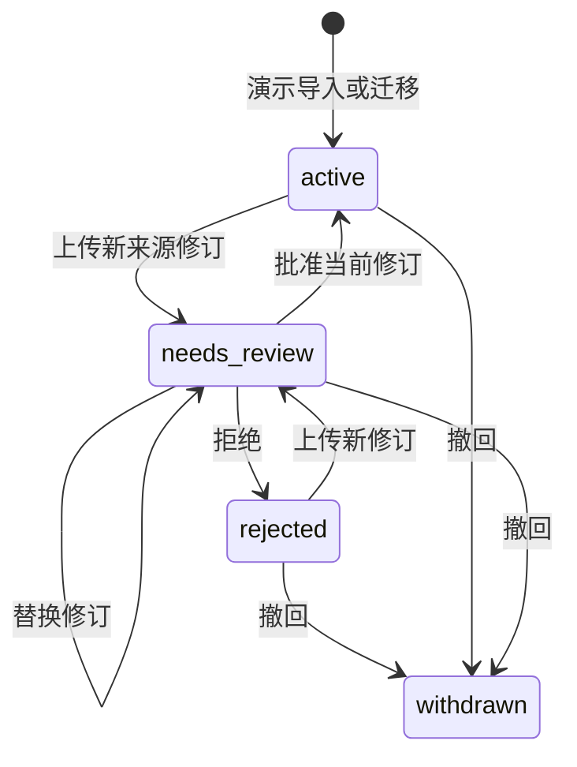

# 知识自维护技术设计与首期实现

本轮范围：F17 手工来源更新、F18 文档级血缘、F19 查询阻断、F20 人工复核、F21 单库事务发布的最小闭环。未实现模型抽取、片段级血缘、多来源裁定、自动同步、后台索引重建或通用回滚。现有固定 payments 演示身份具有维护权限，不构成企业鉴权；不能直接暴露到公网。

## 数据与状态

原 documents 表保留为当前已发布正文的兼容投影，新增不可变 document_revisions 保存每次内容及原因。document_heads 保存当前来源修订、published_revision、generation 和有效性。版本号 version 是显示标签，revision 是单调整数，generation 用于并发与重投保护，不比较用户版本字符串。

新增 relation_sources 为已有文档关联绑定准确来源修订和复核代数；无文档关系保留原语义。task_knowledge_refs 记录实际证据使用的文档修订与任务尝试。maintenance_events 记录更新、批准、拒绝、撤回、关系复核；不存模型内部思维。

初始化旧文档为修订 1，发布状态 active；这只是兼容原演示的信任基线，不声称完成企业审核。旧关系绑定修订 1；旧历史任务缺少血缘时标记未追踪，不能反推其引用最新知识。

新来源修订到达意味着旧来源已不宜继续默认使用，所以立即进入 needs_review，正文列表默认不召回。拒绝新修订不证明旧版本仍正确，不自动复活旧知识。撤回为首期终态；恢复需要后续独立审核设计。

文档批准仅发布原文，不自动确认派生关系。关系的绑定修订不再有效时，查询计算 source_stale；显式复核单条关系，绑定最新已发布修订，才恢复 confirmed。过期关系不能由此复活。没有多来源支持模型，不声称能够做多源裁定。已知直接关系和已登记任务是本轮影响范围，接口明确 coverage，不将业务邻域全图判失效。

## API

- GET /api/documents 默认仅 active；include_inactive=true 为演示维护视图。
- GET /api/documents/{id}/maintenance 返回当前状态、不可变版本、直接关系影响和已登记任务引用，以及审计事件；有返回上限与截断标记。
- POST /api/documents/{id}/revisions 携带 title/body/version/reason/expected_generation：来源修订入库并阻断旧版。
- POST /api/documents/{id}/review 携带 approve/reject、reason、expected_generation：批准发布或保持阻断。
- POST /api/documents/{id}/withdraw 携带 reason/expected_generation：立即撤回。
- POST /api/relations/{id}/review 携带 expected_generation/expected_document_revision/reason：人工确认这条关系在新资料下仍成立，绑定新修订。

写操作 BEGIN IMMEDIATE，在短事务内比较代数并更新版本、指针、审计。重复请求返回 409，不能重复生效；客户端收到未知结果后重读状态，不自动重做。不存在或其他项目返回 404。版本不匹配、无待审修订、撤回后修改返回 409。单库发布不依赖后台重建；后续索引接入必须保留相同查询阻断门槛。维护接口首期仅返回最近 20 个版本、100 条关系、100 条任务引用及 50 个事件，分别给出截断标记；深度分页仍待完善。

## Agent 防护与历史

文档搜索、文档读取、图查询与路径查询统一检查来源状态和绑定修订。图的 all 维护视图可显示 source_stale，但默认确认查询不包含。工具输出携带 knowledge_refs，任务记录按证据保存其版本。每次模型请求前复核已用依赖，最终结果入库的同一事务再次复核；任何失效则 partial，移除模型草稿／修复断言，提示重新取证。无法收回已送给模型的上下文，检查只能阻止后续请求及交付。

确定性任务是固定基线样例，绑定种子文档修订 1；来源改变后不自动用新版资料给旧模板背书。已完成任务保留历史结果并在任务页及证据图显示当前依赖警告；重新执行需要新的任务。未知血缘显式显示，不能宣称已验证。

## 交互与验证

知识页面提供状态、版本历史、编辑来源新修订、批准／拒绝、撤回、影响关系及逐条确认。所有动作展示理由并绑定页面加载时的代数；并发冲突要求刷新。当前审核人固定为 demo-maintainer，接口与页面明确标识。

验证覆盖旧库迁移、重复更新、并发审批、拒绝不复活、撤回检索与图阻断、文档审核不自动批准关系、私有对象、模型在途失效、历史任务警告和事务发布。业务代码变更后运行全量已有测试与构建；不将本轮测试等同于完整 AC29～AC44。

## 本轮验证结果

43 项 Python 测试、源码构建与 JavaScript 语法检查通过。DOM/API 联测脚本验证了完整维护操作和内容转义，并修复既有模型模式选项 HTML 标签错误。实际浏览器视觉、真实模型、Docker 与企业身份尚未验收。
