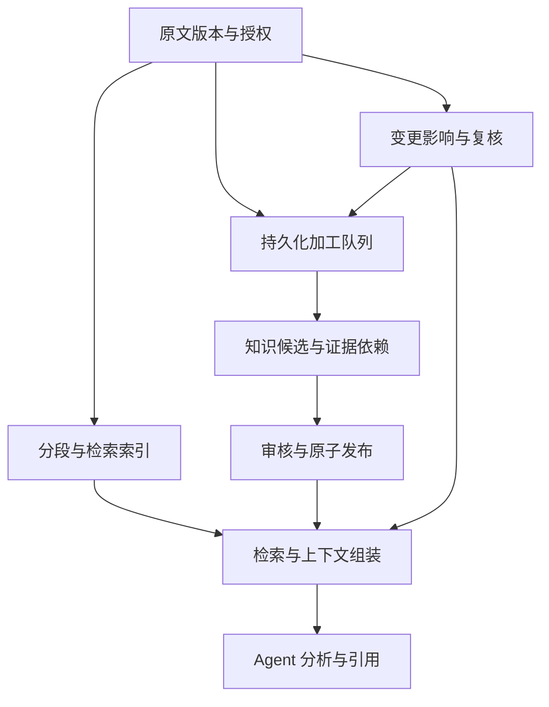

# 企业资料检索与知识自维护技术方案

日期：2026-10-01｜设计稿 v1.0｜尚未实施。需求依据 knowledge-features-v0.5.md 和既有 F17～F22。

## 1. 技术决策

延续 FastAPI + Python Worker + 关系型数据库。演示先用 SQLite，生产按现有企业数据库选择 PostgreSQL/MySQL 等。不要求向量或图数据库；普通 SQL 表表达片段、知识、证据依赖和队列。

采用“原文检索 + 已审核知识检索”双通道。知识加工改善组织与复用，但原文通道始终保留；未经审核的生成知识不进入正式事实召回。对文档上传、索引完成、加工完成、正式发布分别建状态，避免上传成功被理解为知识已建成。

一般问答不绑定支付示例。领域能力包控制提示、工具和状态判定；业务部署/修复等结论继续通过运行证据规则判断。演示模式保持独立，可显式选择。

## 2. 组件与流转

原文批准后排队构建其修订索引；只有完整索引切换成功才可检索。知识加工可独立失败，不影响已有效的原文检索。原文更新/撤回立即收紧可用性，不能等待异步索引清理；索引残留在查询门槛处被拦截。

## 3. 关系数据模型

沿用 documents、document_revisions、document_heads、maintenance_events、task_knowledge_refs。新增表建议：

| 表 | 关键字段 | 约束与用途 |
|---|---|---|
| document_chunks | id, project, document_id, revision, ordinal, heading_path, start_char, end_char, text, hash | 唯一(document_id, revision, chunker_version, ordinal)；字符偏移指向规范化文本 |
| index_builds | id, source_revision, generation, parser_version, chunker_version, status, checksum | 完整构建后切换 active pointer；旧构建不能覆盖新修订 |
| chunk_terms | project, chunk_id, term, tf, field | SQL 倒排索引，支持标题/正文和中文词项 |
| processing_jobs | id, project, type, source_revision, fingerprint, state, lease_owner, lease_epoch, attempts, checkpoint | 幂等键与租约；与现有 Worker 管理规则一致 |
| knowledge_items | id, project, kind, canonical_key, owner, published_revision | 来源摘要、FAQ、概念、事实等；不与业务对象混同 |
| knowledge_revisions | item_id, revision, body, status, base_revision, valid_from, valid_to | 不可变候选；发布需基准修订一致 |
| knowledge_supports | item_id, item_revision, claim_id, source_revision, chunk_id, stance, scope, quote_range | 单条断言的支持/反证定位；外键和范围校验 |
| knowledge_links | from_item, to_item, link_kind, revision | 导航关联与证据依赖分开存；不自动写 confirmed 业务关系 |
| task_retrieval_events | task_id, attempt, query, channel, chunk_id, score, loaded, cited | 区分搜索结果、上下文装入和最终引用 |

多来源可用性按单条 claim 评估。摘要页包含多个 claim 时，显示其各自状态；某个来源撤回不能仅删除 sources 字段就维持整页有效。来源类型和权威性由配置规则定义，不由模型写入即可生效。

索引状态 building/ready/failed/retired，与原文 active/needs_review/rejected/withdrawn 分离；加工状态 queued/running/failed/cancelled/completed；知识候选 draft/needs_review/active/conflicted/withdrawn。过期可根据业务时间计算，避免状态字段与时间相互矛盾。

## 4. 分段和检索

1. 规范化提取文本并保留标题、段落边界；原始修订不变。Markdown/TXT 优先，PDF/DOCX 解析后加入同一流程。
2. 初始建议每段 800～1600 字符、相邻重叠 100～200 字符，按标题和自然段切分；表格和代码保持逻辑结构，过长部分单独分页。参数为待评测基线，不是容量承诺。
3. 英文大小写归一与词切分；中文双字切分，保留短语。单字匹配只作受限兜底，防止高频字淹没排名。
4. 通过 chunk_terms 查候选；短语、标题、覆盖词数和词频加权。初期采用可解释加权评分，稳定后可加入 BM25；按稳定 ID 打破同分，不依赖数据库自然顺序。
5. 返回命中片段而非文档开头；同文档去重、多文档多样性、相邻段补读；携带 revision、heading_path、位置和截断标记。
6. 可选 embedding 通道：相同授权范围内计算相似度，RRF 合并不同通道排名；不要直接相加不可比的距离和关键词分数。无需独立向量数据库，试点可在关系库存向量并有界扫描，规模增长后再选数据库原生能力。
7. 图扩展仅补充已发布且授权的知识导航关系；限深度/数量，不将关联路径当作结论证据。向量或图失败可降级关键词。

先检索：任务创建时固定资料范围，Worker 在第一次模型请求前根据问题检索并登记证据。模型可再查询，不负责决定首次取证是否发生。指定文档模式直接按选择范围检索；有权文档中无命中时允许有界读取其目录/摘要帮助定位，并明确覆盖不足。

## 5. 上下文、工具和收尾

上下文服务按模型配置估算 token，记录估算方法和实际 usage；无法精确计算时保守预算。分配系统指令、历史、检索片段及输出预留，优先相关片段，避免反复重复原文。不得用字符数伪装成精确 token 数。

工具建议 search_knowledge、read_chunk、read_document_range、list_document_sections；保留旧 search_documents/read_document 为兼容入口。参数严格校验，项目范围由服务端绑定，不能由模型修改。工具输出证据 ID 与不可变来源引用。

总预算覆盖准备检索、模型请求、工具与最终提交，分别记录内部检索/模型工具次数。预留一次 submit_answer，最后一轮只暴露提交工具并提示证据不足时返回缺口；若模型拒绝结构化提交则输出系统生成的部分结果。禁用查询后不能用自由文本宣布成功。保留来源失效前置与提交事务内校验。

当前 4096 默认输出预算是起点，支持项目配置；设置不能超过提供方限制。finish_reason=length 不直接重试完整任务；可在剩余全局预算内一次收尾重试，否则保留证据、标记未完成。收尾也计入模型轮次和费用。

## 6. 两阶段加工与审核

阶段 A：读取来源片段、项目目的、类型约束和有限相关知识，输出结构化实体、概念、断言、引用片段、冲突和建议。长文分块分析后有界汇总，防止全篇硬塞上下文。

阶段 B：根据分析生成来源摘要、FAQ 和知识修订候选；关系候选明确来源与适用范围。使用 JSON schema，不接受模型自由文件路径、SQL 或直接修改事实表。

程序验证来源存在且有效、引用范围合法、类型和必填字段正确、作用范围一致、目标基准版本未变。引用原文存在只验证结构可追溯，不证明语义蕴含；语义支持由人工审核与案例评测判断，模型复核不能作为唯一批准依据。

审核展示候选差异、支持/反证、来源快照、影响清单；短事务内比较来源 generation 和目标 base_revision，写发布指针/审计/outbox。禁止在模型调用期间持有数据库写锁。

## 7. 增量、自维护与恢复

加工幂等键包含 source_revision/content_hash、解析/分段/提示/schema/策略版本；内容相同但授权变化仍触发重新鉴权。缓存命中需检查产物存在且完整，不能仅靠哈希。

来源更新：立即阻断绑定旧版且不满足可用性策略的知识 → 计算证据依赖影响 → 排队局部加工 → 人工审查 → 发布新修订。依赖图环和遍历上限要显式报 coverage；不把业务邻域全图标失效。

Worker 使用租约和 epoch；每次写回比较所有者、epoch、来源 generation。失败重试指数退避、有限次数；格式错误/截断不能无限重试。分块检查点绑定来源指纹；新来源到达时旧检查点不能复用。取消只停止未完成阶段，已发布历史不能静默撤销。

索引构建使用版本隔离，完成后原子切指针；派生候选部分写入不能标记发布成功。outbox 消费幂等；消息漏投由定时对账补偿。撤回先改权威状态，异步清索引与缓存。恢复与回滚重新检查当前授权和来源有效性。

历史任务保留原结果/当时引用，当前显示风险；新增有效知识不覆盖历史快照。已经发给模型的资料无法收回，权限/来源变化只能阻断后续读取和结果交付。

## 8. API 建议

| 接口 | 用途 |
|---|---|
| POST /api/tasks | 增加 knowledge_scope、document_ids、retrieval_mode、domain；旧参数默认兼容 |
| GET /api/search | 返回有效片段、分数、检索模式与版本；分页有界 |
| GET /api/documents/{id}/revisions/{revision}/chunks | 原文修订的分段目录与分页；历史读取仍检查权限 |
| GET /api/chunks/{id} | 读取片段及相邻上下文；返回可用状态与位置 |
| POST /api/documents/{id}/process | 创建加工任务，附 expected_generation、idempotency_key |
| GET /api/processing-jobs/{id} | 进度、错误、检查点、成本摘要 |
| POST /api/processing-jobs/{id}/cancel | 取消未完成阶段，保留执行记录 |
| POST /api/processing-jobs/{id}/retry | 创建新的受限尝试，重新校验来源 |
| GET /api/knowledge/{id}/revisions | 候选与发布版本、支持/反证 |
| POST /api/knowledge/{id}/review | 绑定来源 generation、目标 revision 与审核理由 |
| GET /api/tasks/{id}/retrieval | 候选、已读、最终引用分层记录 |

新 API 需分页、输入上限、幂等及标准错误码；不将维护视图默认开放给普通用户。固定演示身份期间明确本地试点边界。

## 9. 迁移与发布

先备份并记录数据库 schema 版本。新增表不破坏现有任务/修订；为 active 发布修订分批构建片段，待 ready 后切到新检索。源在构建时变化则取消切换。功能开关允许暂回旧检索，但旧检索也必须保持最新状态/授权阻断。

旧文档来源无证明的种子信任不能扩展到模型生成知识；新知识从候选开始。旧任务血缘缺失显示未追踪，不绑定推测片段。数据库升级支持中断续跑，不能每次启动重复全量加工或发模型请求。

## 10. 实施里程碑

| 阶段 | 交付 | 验收门槛 |
|---|---|---|
| M1 资料可用 | F23～F25/F27；分段、中文检索、指定资料、先取证、引用面板 | AC45～AC50/AC53～AC54；自有长文后半段可定位，撤回拦截 |
| M2 稳定回答 | F26；上下文预算、提交预留、有界收尾 | AC51～AC52；总预算不超限，无证据不编造 |
| M3 知识加工 | F28～F29；加工队列、结构化候选、审核发布 | AC55～AC58；半成品不发布，旧批准不覆盖新源 |
| M4 自维护闭环 | F30～F32；多来源、增量恢复、巡检评测 | AC59～AC64 与既有 AC29～AC44 对应回归 |
| M5 扩展接入 | PDF/DOCX 等解析、可选向量、真实连接器和企业身份 | 根据真实试点补验收；未完成鉴权不能多用户上线 |

M1 为最高优先级，先不引入自动知识写入。M3 依赖 M1 的片段引用；M4 依赖 M3 的事实级支持。无需先做桌面端、社区发现或自主外网研究。

## 11. 评测与完成定义

建议建立至少 30 条试点检索问题，覆盖中文同义表达、长文后半段、跨文档、无答案、冲突、撤回、权限与更新。这个数量是建设目标，不代表已有真实案例。

记录 Recall@k（人工标注相关片段）、最终引用准确性、答案受支持比例、拒答是否合理、失效/越权拦截、P50/P95 耗时、模型轮次和费用。硬门槛：撤回/越权测试零泄漏、并发旧版本零覆盖、发布失败零半成品生效。检索质量目标在标注集建立后确认，不能引用其他项目 README 的召回率作为本平台结果。

每阶段交付测试报告和未完成项；本地测试、真实模型联调、浏览器交互、Docker 和业务验收分开记录。没有真实模型凭据验收不能宣布供应商兼容完成。

## 12. 参考实现

nashsu/llm_wiki 源码快照 48fd970：
- https://github.com/nashsu/llm_wiki/blob/48fd970/src-tauri/src/commands/search.rs
- https://github.com/nashsu/llm_wiki/blob/48fd970/src/lib/ingest.ts
- https://github.com/nashsu/llm_wiki/blob/48fd970/src/lib/ingest-cache.ts
- https://github.com/nashsu/llm_wiki/blob/48fd970/src/lib/context-budget.ts
- https://github.com/nashsu/llm_wiki/blob/48fd970/src/lib/source-lifecycle.ts
- https://github.com/nashsu/llm_wiki/blob/48fd970/src-tauri/src/agent/context.rs

本方案为基于其实现的设计取舍，不声称它已实现本平台要求的企业鉴权、事实级审核或发布事务。
